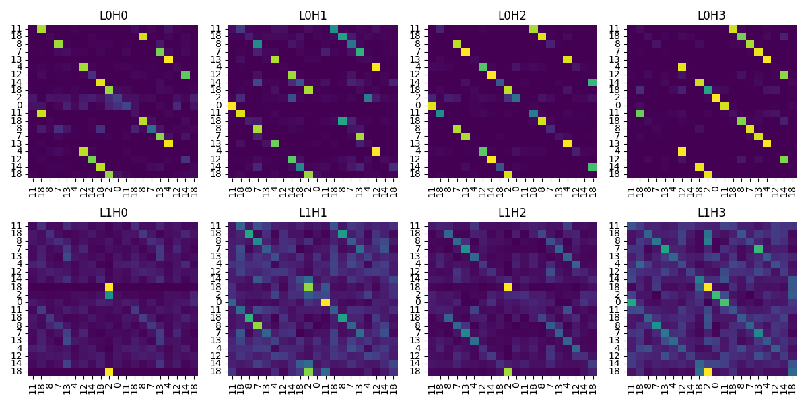
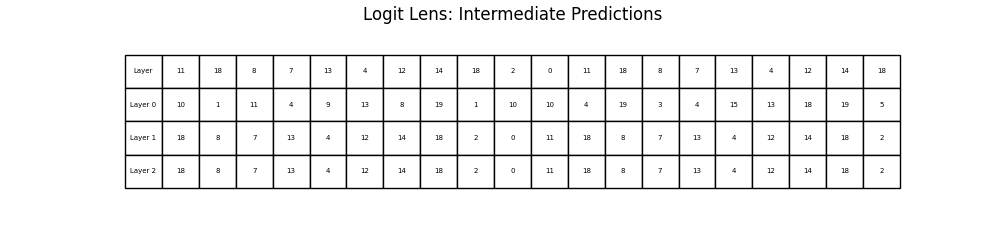
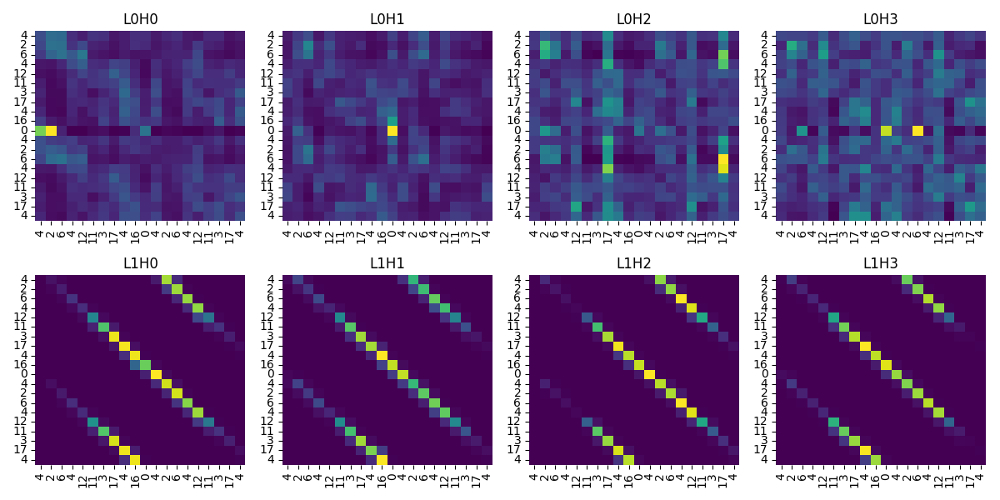
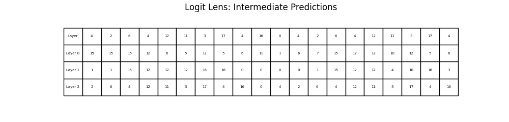

# Week-02-Attention-Under-the-Hood-Hand-Built-Self-Attention-with-Attention-Map-and-Logit-Lens-Probes.
Hand-Built Self-Attention with Attention-Map and Logit-Lens Probes

## Results

Both positional-encoding variants were trained on the copy task for 1000 steps on CUDA and converged nearly identically, from an initial loss of ~3.15–3.18 down to 0.0012 by step 800. On this short-sequence copy task, learned and sinusoidal encodings are effectively interchangeable: both produce the clean diagonal attention pattern and confident logit-lens predictions seen in the probes below, including on the repeats, ascending, and constant input variants.

### Copy-task training logs

=== Positional encoding: learned ===
Training model on copy task (cuda)...
Step 0 | Loss: 3.1541
Step 200 | Loss: 0.0129
Step 400 | Loss: 0.0039
Step 600 | Loss: 0.0019
Step 800 | Loss: 0.0012
Training complete.
Attention map saved to results/attention_maps_learned.png
Logit lens saved to results/logit_lens_learned.png
Attention map saved to results/attention_maps_learned_repeats.png
Logit lens saved to results/logit_lens_learned_repeats.png
Attention map saved to results/attention_maps_learned_ascending.png
Logit lens saved to results/logit_lens_learned_ascending.png
Attention map saved to results/attention_maps_learned_constant.png
Logit lens saved to results/logit_lens_learned_constant.png

=== Positional encoding: sinusoidal ===
Training model on copy task (cuda)...
Step 0 | Loss: 3.1821
Step 200 | Loss: 0.0135
Step 400 | Loss: 0.0038
Step 600 | Loss: 0.0020
Step 800 | Loss: 0.0012
Training complete.
Attention map saved to results/attention_maps_sinusoidal.png
Logit lens saved to results/logit_lens_sinusoidal.png
Attention map saved to results/attention_maps_sinusoidal_repeats.png
Logit lens saved to results/logit_lens_sinusoidal_repeats.png
Attention map saved to results/attention_maps_sinusoidal_ascending.png
Logit lens saved to results/logit_lens_sinusoidal_ascending.png
Attention map saved to results/attention_maps_sinusoidal_constant.png
Logit lens saved to results/logit_lens_sinusoidal_constant.png

### Training Loss

| Step | Learned | Sinusoidal |
|-----:|--------:|-----------:|
| 0    | 3.1541  | 3.1821     |
| 200  | 0.0129  | 0.0135     |
| 400  | 0.0039  | 0.0038     |
| 600  | 0.0019  | 0.0020     |
| 800  | 0.0012  | 0.0012     |

### Interpretability Probes

**Learned positional encoding**

**Sinusoidal positional encoding**

